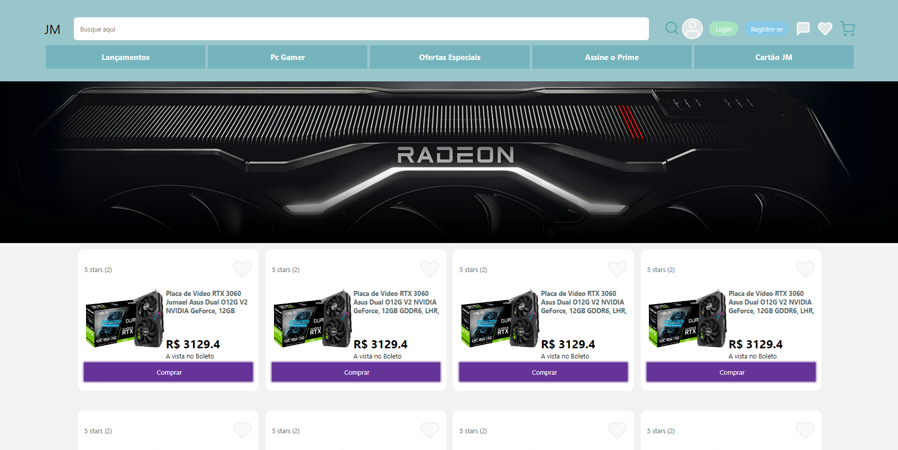
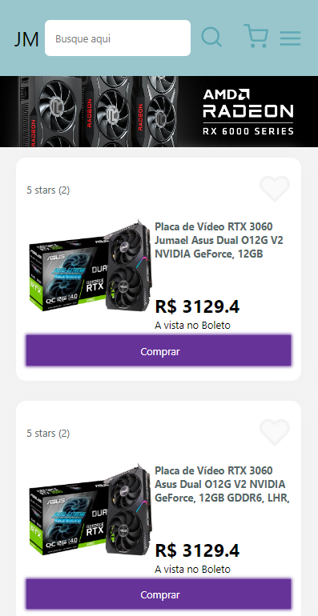
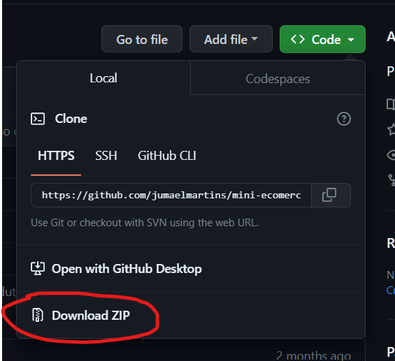

# Mini E-Commerce


Projeto de um Mini E-Commerce, a ideia do projeto é implementar um site de compras online, com uma listagem de produtos, opção de filtragem e adicionar items no carrinho. é um projeto de testes, então os produtos contidos na paginas não estão a vendas, não é possivel realizar transações de compra real nesse projeto blz?!

##### Previa Desktop

##### Previa Mobile



### Ajustes e melhorias

O projeto ainda está em desenvolvimento e as próximas atualizações serão voltadas nas seguintes tarefas:

#### Já implementado

- [X] listagem de produtos
- [X] filtragem dos produtos por busca
- [X] paginação dos items
- [X] adicionar item ao carrinho
- [X] slider das imagems dos produtos

#### Será Implementado

- [ ] Responsividade para Desktop.
- [ ] Interatividade na pagina do carrinho, contagem dos items e somar dos valores;
- [ ] Tela de Login
- [ ] Adicionar Items aos Favoritos
- [ ] Salvar preferencias em local storage

## 💻 Pré-requisitos

Antes de começar, verifique se você atendeu aos seguintes requisitos:

* Você instalou a versão mais recente de `<node JS / gitbash>`
* Você tem uma máquina `<Windows / Linux / Mac>`.

## 🚀 Instalando <Mini E-Commerce>

Para instalar o <Mini E-Commerce>, siga estas etapas:

Abra o terminal no diretorio que voce deseja instalar o app
```
<git clone https://github.com/jumaelmartins/mini-ecomerce.git>
```

ou se prefirir baixe a pasta com os arquivos direto no github




## ☕ Usando <Mini E-Commerce>

Para usar <Mini E-Commerce>, siga estas etapas:

Com o terminal aberto na pasta raiz do projeto insira os comandos abaixo:
```
instalar dependencias
<npm i>
```

```
iniciar o servidor em ambiente de densevolvimento
<npm run dev>
```

Opcional

```
iniciar o servidor em ambiente de produção
<npm run build>
<npm run preview>
```

## 🚧 Ferramentas Utilizadas no desenvolvimentoo:

- Flexbox
- SASS / SCSS
- Mobile First
- Vite
## 💥O que aprendi ao desenvolver esse projeto:

- Fazer um Carrousel
- Paginação de items
- Metodos de Arrays e Objetos
- Filtragem de items

## 📫 Contribuindo para <Mini E-Commerce>

Para contribuir com <Mini E-Commerce>, siga estas etapas:

1. Bifurque este repositório.
2. Crie um branch: `git checkout -b <nome_branch>`.
3. Faça suas alterações e confirme-as: `git commit -m '<mensagem_commit>'`
4. Envie para o branch original: `git push origin <Mini E-Commerce> / <local>`
5. Crie a solicitação de pull.

Como alternativa, consulte a documentação do GitHub em [como criar uma solicitação pull](https://help.github.com/en/github/collaborating-with-issues-and-pull-requests/creating-a-pull-request).
